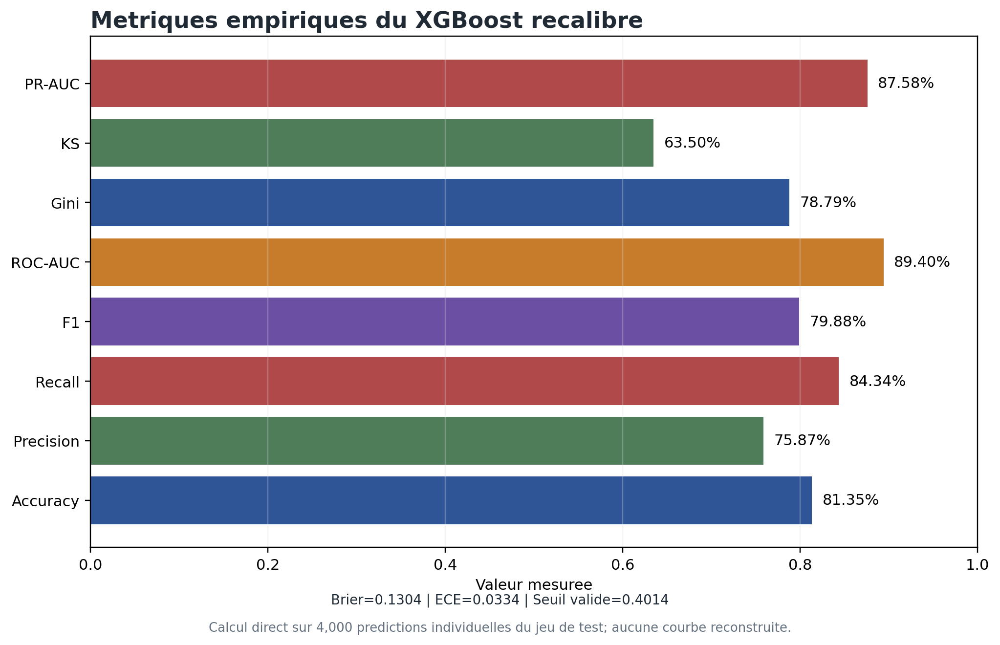
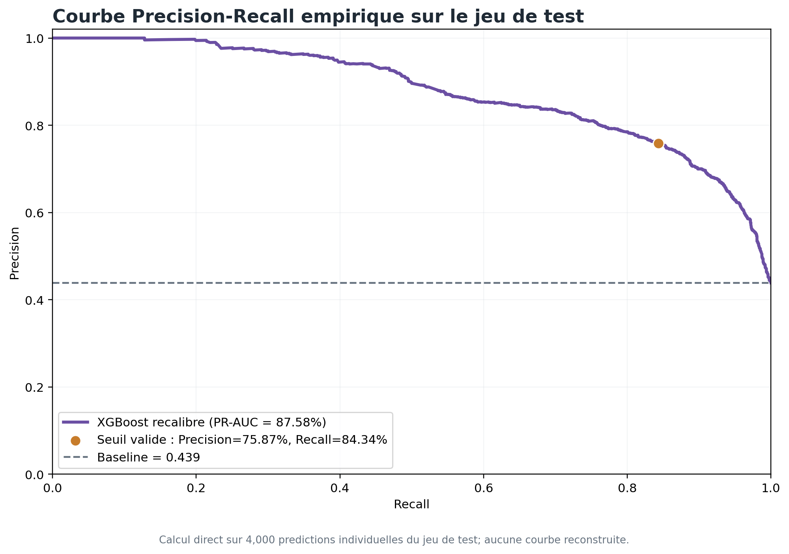
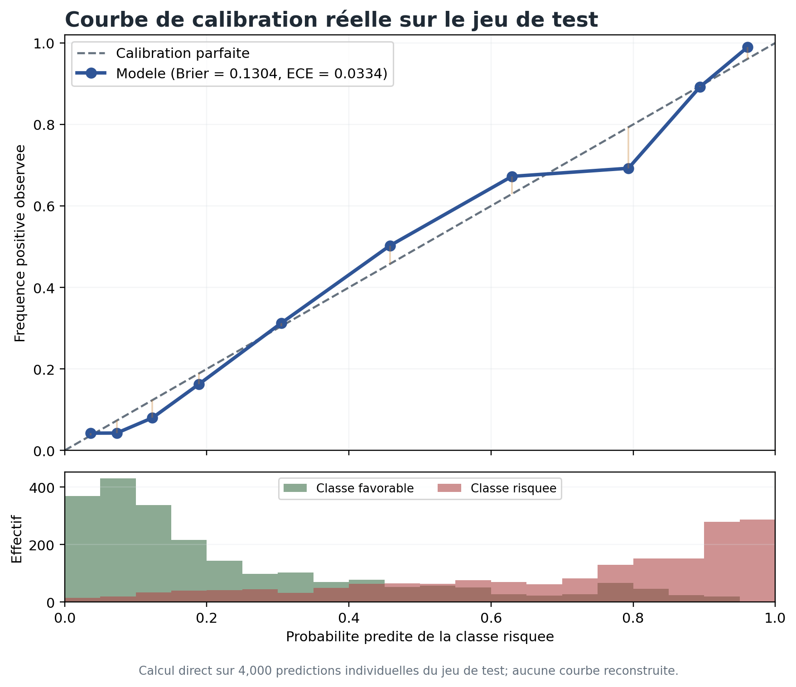
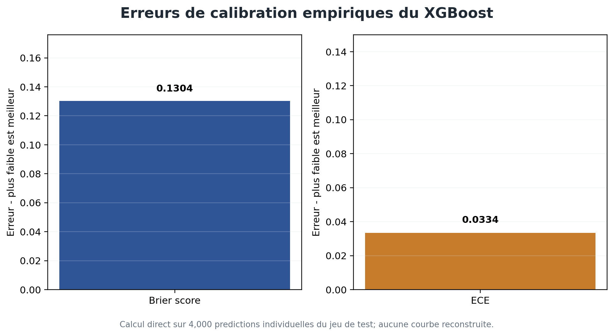
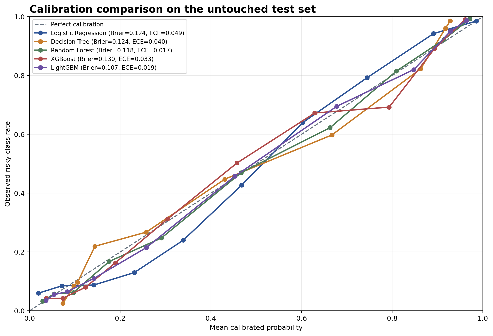

# Metrics et courbes du modele

Les cinq modeles sont entraines sur le meme jeu de 18 variables, recalibres par methode sigmoide sur une periode de validation, puis dotes d'un seuil maximisant le F1 sur une seconde periode de validation. Le test final de 4 000 dossiers n'est utilise ni pour la calibration ni pour le choix du seuil.

Important : le calcul est reel et reproductible, mais le dataset du projet reste synthetique. Il ne s'agit donc pas de donnees bancaires reelles.

## Tableau des metriques recalculees

| Metric | Logistic Regression | Decision Tree | Random Forest | XGBoost | LightGBM |
|---|---:|---:|---:|---:|---:|
| Accuracy | 82.88% | 82.05% | 83.05% | 81.35% | 85.05% |
| Precision | 79.06% | 78.08% | 77.81% | 75.87% | 80.77% |
| Recall | 82.97% | 82.18% | 85.88% | 84.34% | 86.56% |
| F1-score | 80.97% | 80.08% | 81.65% | 79.88% | 83.56% |
| ROC-AUC | 90.09% | 90.49% | 90.95% | 89.40% | 92.22% |
| Gini | 80.18% | 80.98% | 81.89% | 78.79% | 84.43% |
| KS | 66.14% | 64.41% | 67.21% | 63.50% | 70.71% |
| PR-AUC | 89.41% | 89.25% | 89.79% | 87.58% | 91.30% |
| Brier Score | 0.124 | 0.124 | 0.118 | 0.130 | 0.107 |
| ECE | 0.049 | 0.040 | 0.017 | 0.033 | 0.019 |
| Selected threshold | 0.455 | 0.432 | 0.400 | 0.401 | 0.406 |

LightGBM obtient la meilleure ROC-AUC, le meilleur F1 et le plus faible Brier score. Random Forest obtient la plus faible ECE. XGBoost n'est donc pas le meilleur modele dans cette comparaison recalculee.

## Figures generees














## Regeneration

```bash
python scripts/train_calibrate_compare_models.py
python scripts/generate_real_auc_ks_threshold_curves.py
```

Ou via le generateur global :

```bash
python scripts/generate_all_img_assets.py --group metrics --list
```

Les points numeriques utilises pour tracer ROC, KS, calibration et seuil sont exportes dans `reports/real_curves/`.
