# Rapport d'analyse exploratoire et de modelisation

Projet : Systeme intelligent de prediction du risque de credit BMCE

## 1. Objectif du projet

L'objectif du projet est de construire une solution de scoring credit permettant d'estimer le risque associe a une nouvelle demande de credit. Le systeme combine :

- une analyse exploratoire des donnees clients ;
- un nettoyage et un feature engineering metier ;
- une comparaison de modeles de classification ;
- un traitement du desequilibre de classes avec SMOTE ;
- une optimisation des hyperparametres avec GridSearchCV ;
- une API FastAPI et un dashboard Streamlit pour l'exploitation.

La variable cible est `target_default` :

- `0` : avis favorable ;
- `1` : dossier risque, correspondant a `Avis defavorable`, `Etude approfondie` ou `Non eligible`.

Cette definition permet de regrouper les dossiers qui necessitent une attention risque, au lieu de ne considerer que les refus stricts.

## 2. Description generale du dataset

Le fichier utilise est `dataset_credit_bmce_100k.csv`.

Remarque importante sur les types de credit : dans le CSV, la modalite `Personnel` correspond au credit a la consommation/personnel. Elle regroupe des objets comme sante, mariage, voyage, equipement maison, besoin personnel ou etudes. Dans le dashboard, ce type est affiche plus clairement sous le libelle `Consommation / Personnel`.

| Indicateur | Valeur |
|---|---:|
| Nombre de lignes | 100 000 |
| Nombre de colonnes brutes | 47 |
| Nombre de colonnes apres creation de la cible | 48 |
| Taux de dossiers risques | 44,36 % |
| Taux de valeurs manquantes dans le CSV brut | 18,43 % |
| Taux apres creation de la cible | 18,04 % |
| Doublons detectes | 0 |

La repartition de la cible apres construction est :

| Classe | Signification | Nombre |
|---|---|---:|
| 0 | Avis favorable | 55 638 |
| 1 | Avis defavorable, etude approfondie ou non eligible | 44 362 |

La distribution initiale par decision bancaire est :

| Decision | Nombre |
|---|---:|
| Avis favorable | 55 638 |
| Avis defavorable | 26 127 |
| Etude approfondie | 16 719 |
| Non eligible | 1 516 |

### Dataset card et tracabilite

| Champ | Valeur |
|---|---|
| Nature | Jeu de demandes de credit entierement synthetique |
| Unite d'observation | Une demande simulee |
| Periode simulee | 2023-01-01 au 2026-03-26 |
| Taille du fichier | 25 557 339 octets, environ 24,37 Mio |
| Empreinte SHA-256 | `45C23401EA6A9818145D6D388ACC2C782000D01AA18377EA098751A498F17119` |
| Producteur et generateur | Non documentes dans le depot |
| Licence | Non specifiee |

La cible technique `target_default` est derivee de la decision synthetique. Elle ne represente pas un defaut de remboursement reellement observe. Le nom du fichier ne prouve pas une origine ou une validation par BMCE Bank of Africa. Le jeu sert uniquement a l'experimentation academique, a l'EDA et au prototypage ; il ne doit pas etre utilise pour accepter, refuser ou tarifer un credit reel, produire un score reglementaire ou conclure sur la population marocaine.

Le depot ne contient ni le script de generation, ni les distributions sources, ni la graine aleatoire. La generation exacte n'est donc pas reproductible. La dataset card complete, avec le dictionnaire des 47 variables, la qualite, les biais, la confidentialite et les consignes de maintenance, se trouve dans `DATASET_CARD.md`. Elle est egalement integree a l'annexe F du rapport PFE complet `reports/rapport_pfe_complet_fr.md`.

Figure associee :

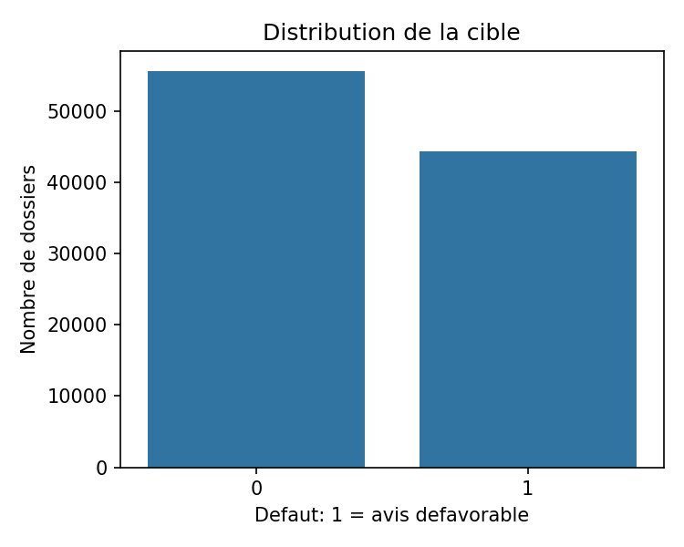

## 3. Qualite des donnees

L'analyse des valeurs manquantes montre que certaines colonnes sont fortement incompletes. Cela s'explique par la nature conditionnelle de certaines informations :

- les informations de garantie ne sont presentes que lorsqu'une garantie existe ;
- les variables liees au vehicule ne concernent que les credits auto ;
- les variables liees au bien immobilier ne concernent que les credits immobiliers.

Les colonnes les plus manquantes sont notamment :

| Variable | Taux de valeurs manquantes |
|---|---:|
| ratio_couverture | 76,79 % |
| valeur_garantie | 76,79 % |
| type_garantie | 76,79 % |
| garantie_presente | 75,27 % |
| valeur_bien | 75,27 % |
| type_bien | 75,27 % |
| localisation_bien | 75,27 % |
| prix_vehicule | 66,94 % |
| age_vehicule | 66,94 % |
| marque_vehicule | 66,94 % |

Ces valeurs manquantes ne sont donc pas uniquement des erreurs de saisie. Elles ont une signification metier : toutes les demandes ne concernent pas les memes produits bancaires.

Dans le pipeline de modelisation, les valeurs manquantes sont traitees par :

- imputation par la mediane pour les variables numeriques ;
- imputation par la modalite la plus frequente pour les variables categorielles ;
- encodage OneHotEncoder pour les categories.

## 4. Analyse exploratoire des variables numeriques

Les distributions suivantes ont ete generees pour analyser le comportement des principales variables selon la cible.

### Age

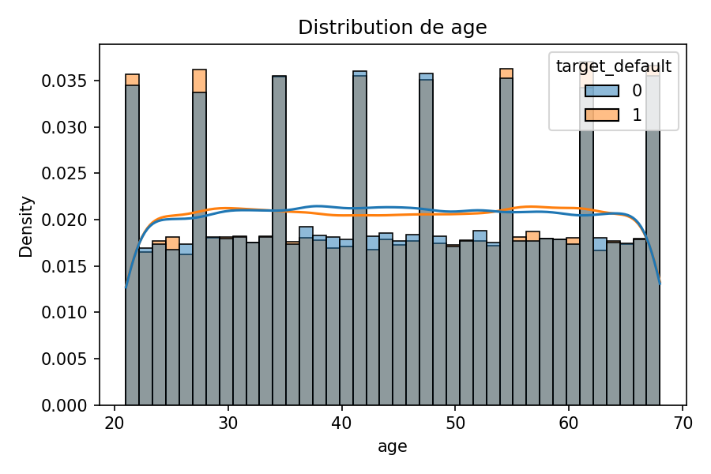

L'age permet d'observer si certaines tranches de clients presentent un niveau de risque plus eleve. Il est ensuite transforme en variable categorielle `age_bin`.

### Revenu mensuel

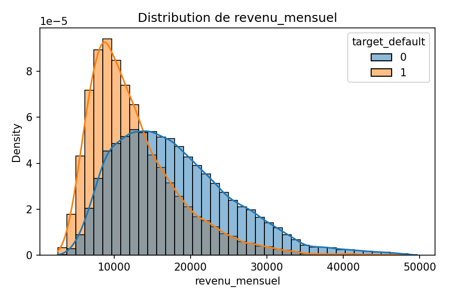

Le revenu mensuel est une variable importante dans l'analyse credit. Les revenus plus faibles peuvent etre associes a une capacite de remboursement plus limitee, surtout lorsque les charges et mensualites existantes sont elevees.

### Montant du credit

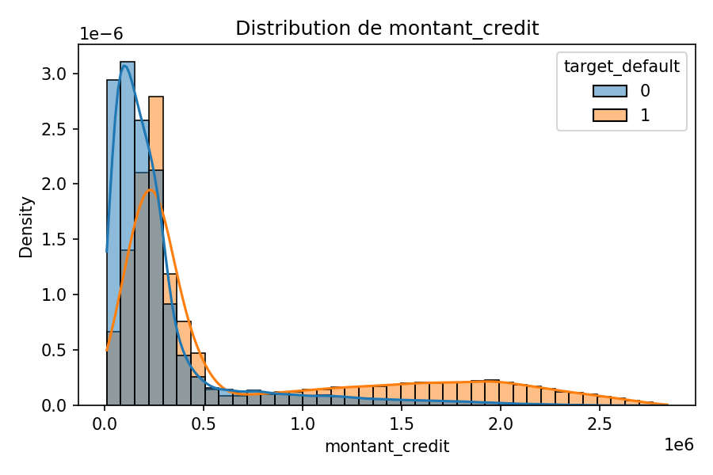

Le montant du credit influence directement le niveau d'exposition de la banque. Il doit etre interprete conjointement avec le revenu, l'apport personnel, la duree et les charges.

### Duree du credit

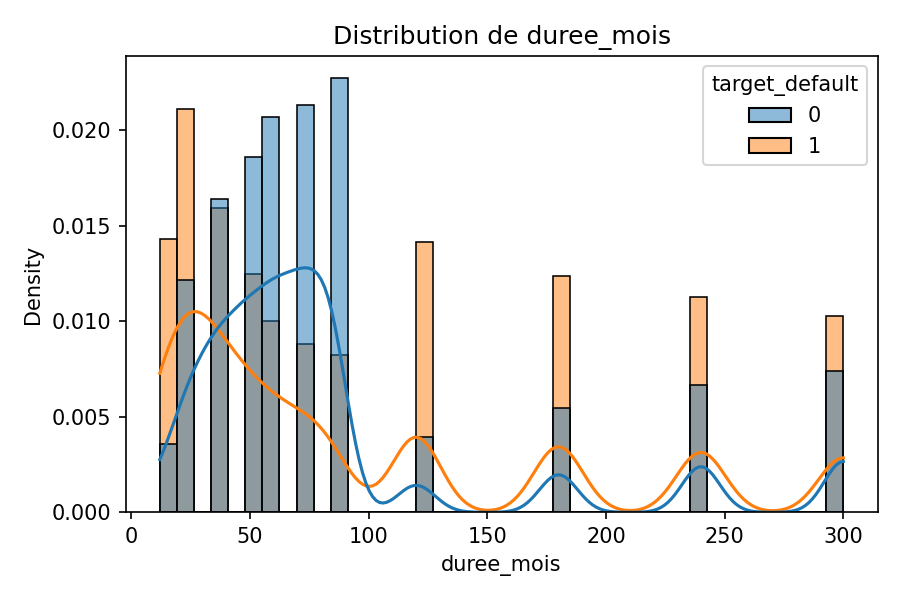

La duree peut reduire la mensualite mais augmenter l'exposition dans le temps. Elle est donc importante dans la lecture du risque global.

### Taux d'endettement

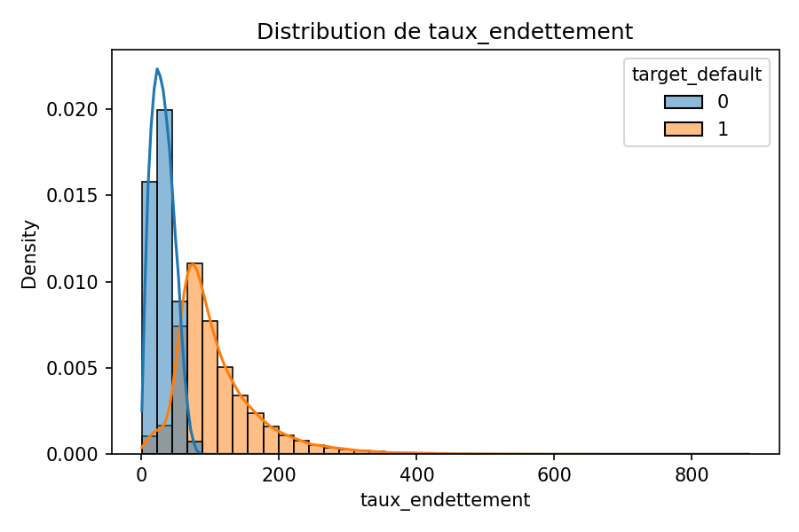

Le taux d'endettement est fortement lie au risque. Toutefois, pour eviter une evaluation trop optimiste, certaines variables tres proches des regles de decision bancaire sont exclues de l'entrainement final lorsqu'elles ressemblent a des sorties de politique interne.

## 5. Matrice de correlation

La matrice de correlation permet d'identifier les relations lineaires entre variables numeriques.

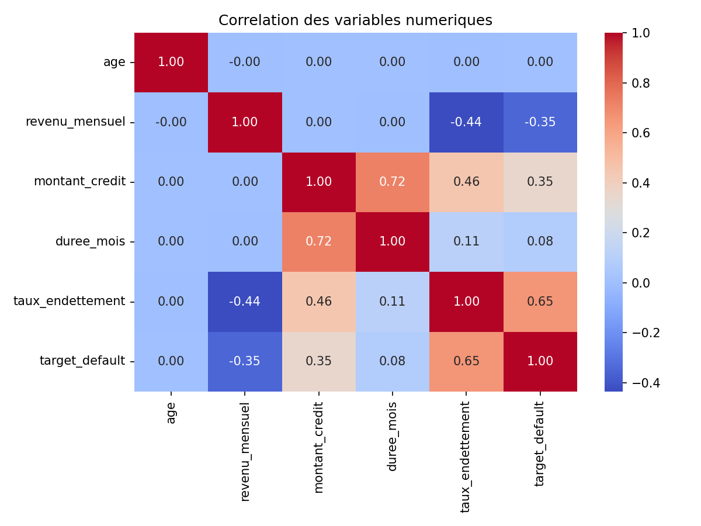

Les variables les plus correlees avec la cible sont :

| Variable | Correlation absolue avec la cible |
|---|---:|
| score_defaut | 0,865 |
| reste_a_vivre | 0,682 |
| dti_calcule | 0,653 |
| taux_endettement | 0,653 |
| mensualite_estimee | 0,531 |
| valeur_garantie | 0,479 |
| valeur_bien | 0,478 |
| ratio_credit_revenu | 0,413 |
| revenu_total | 0,374 |
| revenu_mensuel | 0,351 |

Certaines variables, comme `score_defaut`, `decision` et `niveau_risque`, sont considerees comme des variables de fuite de cible. Elles sont donc exclues du modele car elles representent deja une information issue de la decision finale ou tres proche de celle-ci.

## 6. Feature engineering

Le feature engineering permet d'ajouter des variables plus expressives a partir des donnees brutes.

Les principales variables creees sont :

| Variable creee | Explication |
|---|---|
| `revenu_total` | Revenu mensuel + revenu supplementaire |
| `dti_calcule` | Ratio mensualites totales / revenu total |
| `reste_a_vivre` | Revenu total moins charges et mensualites |
| `taux_epargne` | Epargne mensuelle / revenu total |
| `ratio_credit_revenu` | Montant du credit / revenu total |
| `incident_ou_retard` | Indicateur binaire si incident ou retard de paiement |
| `annee_demande` | Annee extraite de la date de demande |
| `mois_demande` | Mois extrait de la date de demande |
| `age_bin` | Tranche d'age |
| `revenu_bin` | Tranche de revenu |
| `montant_credit_bin` | Tranche de montant de credit |

Ces variables apportent une lecture metier plus riche que les variables brutes. Par exemple, le revenu seul ne suffit pas : il faut le comparer aux charges, aux mensualites existantes et au montant demande.

Les variables metier prises en compte par les modeles avances incluent notamment :

- incidents de paiement sur 12 mois ;
- retards de paiement sur 12 mois ;
- apport personnel ;
- credits en cours ;
- mensualites existantes ;
- charges mensuelles ;
- epargne mensuelle ;
- solde moyen du compte ;
- anciennete bancaire ;
- revenu total ;
- reste a vivre ;
- ratio credit / revenu ;
- indicateur incident ou retard.

## 7. Preprocessing

Le preprocessing applique avant entrainement comprend :

1. Nettoyage des colonnes et suppression des doublons.
2. Conversion de la date de demande.
3. Construction de la cible `target_default`.
4. Suppression des variables de fuite :
   - `id_demande` ;
   - `decision` ;
   - `score_defaut` ;
   - `niveau_risque`.
5. Exclusion de certaines variables tres proches des regles de decision bancaire afin d'eviter un score artificiellement parfait.
6. Imputation des valeurs manquantes.
7. Standardisation des variables numeriques.
8. Encodage des variables categorielles.

## 8. Desequilibre des classes et SMOTE

Avant SMOTE, l'echantillon d'entrainement contient :

| Classe | Nombre |
|---|---:|
| 0 | 8 884 |
| 1 | 7 116 |

La classe risquee est moins representee que la classe favorable. Cela peut pousser le modele a mieux apprendre la classe majoritaire.

Apres application de SMOTE sur l'ensemble d'entrainement uniquement :

| Classe | Nombre |
|---|---:|
| 0 | 8 884 |
| 1 | 8 884 |

SMOTE cree des exemples synthetiques de la classe minoritaire. Il est applique uniquement sur le jeu d'entrainement afin d'eviter toute fuite d'information vers le jeu de test.

Effet attendu :

- meilleure sensibilite aux dossiers risques ;
- amelioration du rappel de la classe 1 ;
- reduction du biais vers les avis favorables.

## 9. Modeles compares

Trois modeles sont compares :

### Regression logistique

La regression logistique est utilisee comme baseline traditionnelle. Elle est simple, interpretable et souvent utilisee comme reference en scoring credit.

Dans ce projet, elle est volontairement limitee a un socle de variables classiques du dossier client. Elle utilise tout de meme :

- SMOTE ;
- GridSearchCV ;
- regularisation L2.

Cette configuration permet de montrer les limites d'une methode statistique traditionnelle face a des modeles non lineaires.

### Random Forest

Random Forest est un modele d'ensemble base sur plusieurs arbres de decision. Il gere mieux les relations non lineaires et les interactions entre variables.

Dans le projet, il utilise l'ensemble des variables metier disponibles apres preprocessing.

### XGBoost

XGBoost est un modele de boosting performant pour les donnees tabulaires. Il apprend progressivement des arbres corrigeant les erreurs des arbres precedents.

Pour eviter un modele trop parfait, XGBoost est regularise avec :

- profondeur faible ;
- learning rate faible ;
- subsampling ;
- colsample_bytree ;
- regularisation L2 ;
- min_child_weight ;
- gamma.

## 10. GridSearchCV

GridSearchCV permet de tester plusieurs combinaisons d'hyperparametres et de retenir la meilleure selon le score ROC-AUC.

L'interet de GridSearchCV est de rendre la comparaison plus rigoureuse :

- les parametres ne sont pas choisis manuellement au hasard ;
- chaque modele est optimise sur validation croisee ;
- la comparaison finale est faite sur un jeu de test separe.

Exemples d'hyperparametres optimises :

- `C` pour la regression logistique ;
- `max_depth`, `min_samples_leaf`, `n_estimators` pour Random Forest ;
- `learning_rate`, `max_depth`, `reg_lambda`, `subsample`, `gamma` pour XGBoost.

## 11. Resultats des modeles

Les chiffres ci-dessous sont recalcules apres calibration sigmoide de chaque modele. Le seuil de chaque classifieur maximise le F1 sur une periode de validation distincte ; le jeu de test reste reserve au calcul final des metriques.

| Modele | Accuracy | Precision | Recall | F1 | ROC-AUC | Gini | KS |
|---|---:|---:|---:|---:|---:|---:|---:|
| Regression logistique | 0,8288 | 0,7906 | 0,8297 | 0,8097 | 0,9009 | 0,8018 | 0,6614 |
| Arbre de decision | 0,8205 | 0,7808 | 0,8218 | 0,8008 | 0,9049 | 0,8098 | 0,6441 |
| Random Forest | 0,8305 | 0,7781 | 0,8588 | 0,8165 | 0,9095 | 0,8189 | 0,6721 |
| XGBoost | 0,8135 | 0,7587 | 0,8434 | 0,7988 | 0,8940 | 0,7879 | 0,6350 |
| LightGBM | 0,8505 | 0,8077 | 0,8656 | 0,8356 | 0,9222 | 0,8443 | 0,7071 |

Interpretation :

- LightGBM obtient la meilleure ROC-AUC (0,9222), le meilleur F1 (0,8356) et le meilleur Brier score (0,1074).
- Random Forest presente la plus faible ECE (0,0171), donc le plus petit ecart moyen de calibration selon cette mesure.
- XGBoost atteint une ROC-AUC reelle de 0,8940 apres recalibration, mais n'est pas le meilleur modele de ce protocole.
- Ces resultats restent une validation methodologique sur donnees synthetiques, sans pretendre a une validation bancaire reelle.

## 12. Evaluation detaillee du modele XGBoost recalibre

### Courbe ROC

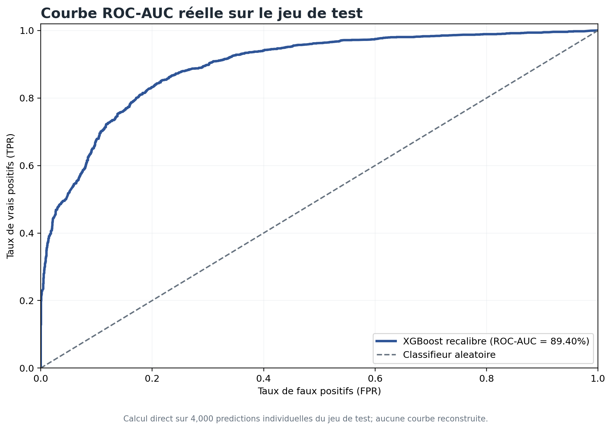

Cette courbe est calculee point par point a partir des probabilites recalibrees pour les 4 000 observations du jeu de test. La ROC-AUC obtenue est de 0,8940 (Gini = 0,7879). Elle n'est ni reconstruite depuis une metrique agregee, ni plafonnee.

### Courbe KS

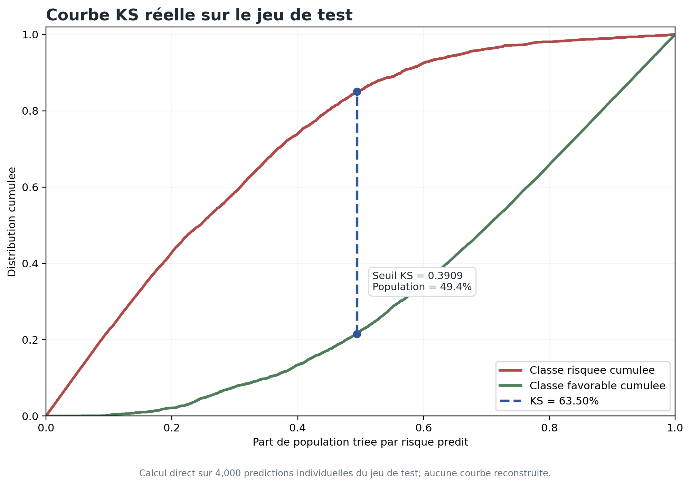

Le maximum de l'ecart entre les distributions cumulees est KS = 0,6350. Il est atteint pour un score de risque proche de 0,3909. Le calcul traite correctement les ex aequo en utilisant les seuils distincts issus de la courbe ROC.

### Courbe de calibration

La calibration est calculee sur dix groupes de probabilites de meme effectif. Apres recalibration sigmoide sur validation separee, le Brier score vaut 0,1304 et l'erreur de calibration attendue (ECE) 0,0334.

### Matrice de confusion

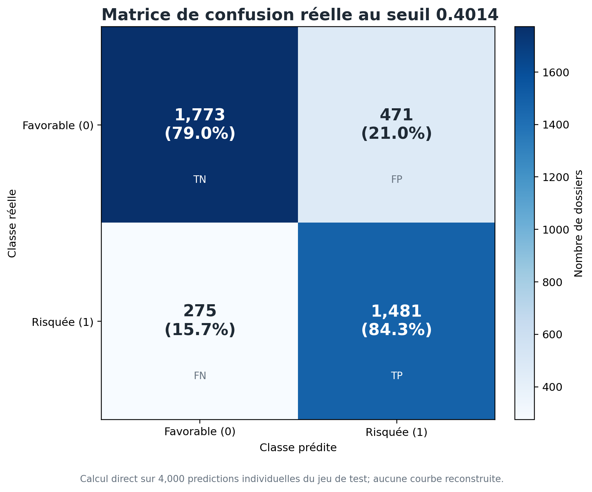

La matrice est calculee directement sur les 4 000 observations du jeu de test au seuil valide de 0,4014. Elle contient 1 773 vrais negatifs, 471 faux positifs, 275 faux negatifs et 1 481 vrais positifs. Elle permet d'analyser :

- les vrais positifs : dossiers risques bien detectes ;
- les vrais negatifs : dossiers favorables bien acceptes ;
- les faux positifs : dossiers favorables classes comme risques ;
- les faux negatifs : dossiers risques classes comme favorables.

Dans le credit, les faux negatifs sont particulierement sensibles car ils peuvent conduire a accepter un dossier risque. Ici, cette lecture reste methodologique : elle ne remplace pas une validation sur donnees bancaires reelles.

## 13. Analyse des seuils de decision

Le seuil retenu pour XGBoost est 0,4014. Il maximise le F1 sur le jeu de validation reserve au choix du seuil, avant toute consultation des cibles de test.

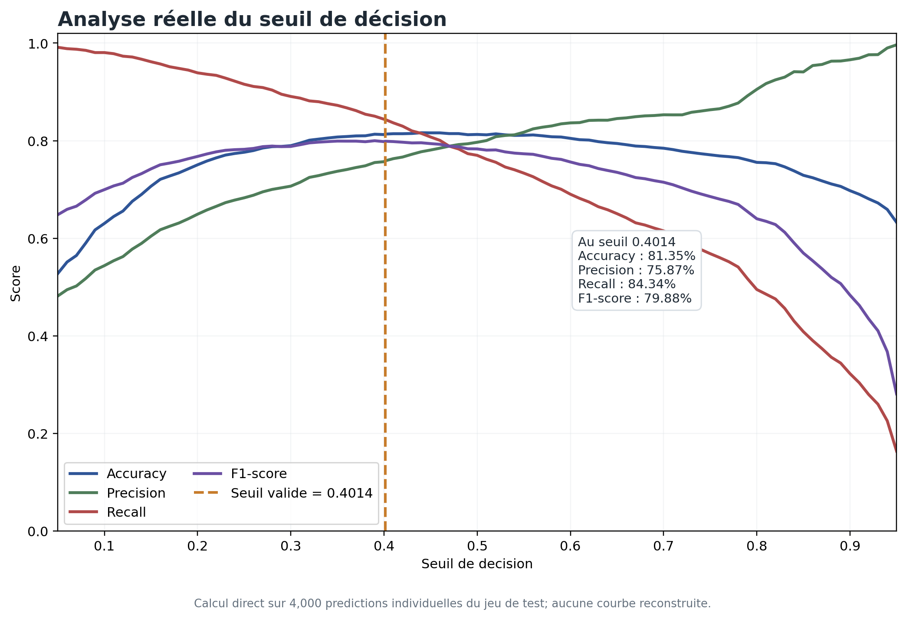

| Seuil | Effet principal | Interpretation |
|---:|---|---|
| 0,30 | Rappel plus eleve | Davantage de dossiers risques sont detectes, au prix de plus de faux positifs |
| 0,4014 | Seuil valide | Accuracy test 0,8135 ; precision 0,7587 ; rappel 0,8434 ; F1 0,7988 |
| 0,70 | Precision plus elevee | Les alertes sont plus selectives, mais davantage de dossiers risques peuvent etre manques |

Interpretation :

- Un seuil faible augmente le rappel : le modele detecte plus de dossiers risques.
- Un seuil eleve augmente la precision : les dossiers classes comme risques sont plus selectifs.
- Le seuil final devrait dependre de la politique risque de la banque et etre valide sur donnees reelles avant tout usage operationnel.
- Le seuil n'a pas ete optimise sur le test : le F1 test de 0,7988 est une mesure finale hors echantillon.

## 14. Importance des variables et explicabilite

### Importance des variables

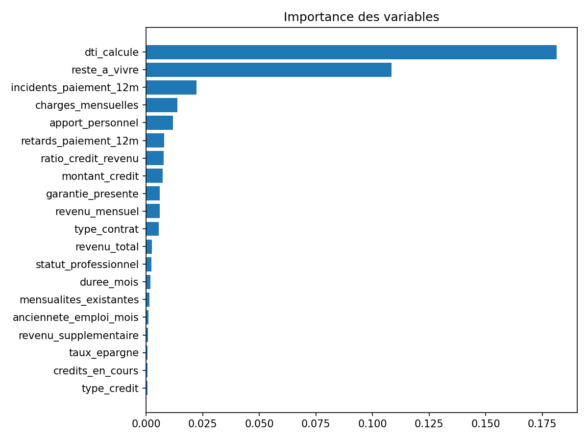

L'importance des variables permet d'identifier les facteurs les plus influents dans la prediction.

### Analyse SHAP

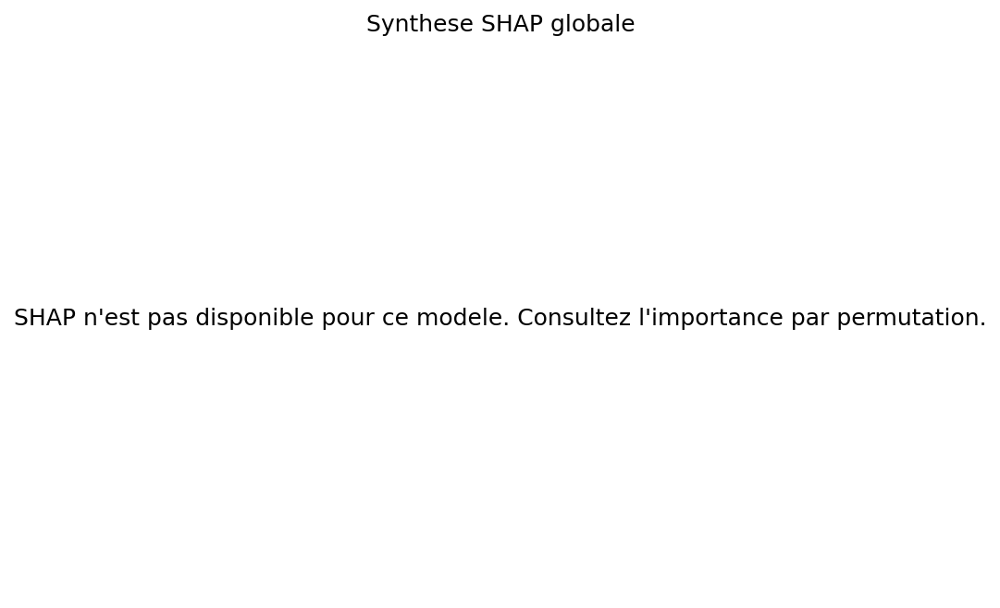

SHAP permet d'expliquer l'impact des variables sur les predictions du modele. Il ne prouve pas une causalite, mais il aide a comprendre pourquoi certains dossiers sont classes comme plus risques.

## 15. Dashboard et exploitation

Le dashboard Streamlit permet :

- de visualiser les indicateurs globaux du portefeuille ;
- de scorer un nouveau demandeur ;
- d'afficher une jauge de risque ;
- de comparer le demandeur avec des clients similaires ;
- de faire un scoring par lot via upload CSV ;
- de filtrer les clients par ville, type de credit, decision, age et montant ;
- d'exporter les resultats ;
- de suivre les logs des predictions ;
- d'analyser la qualite des donnees.

Cette interface transforme le modele en outil exploitable pour une demonstration metier.

## 16. Architecture technique

L'architecture du projet suit une logique modulaire :

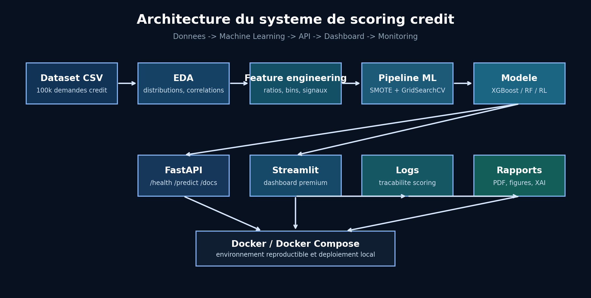

Le flux principal est le suivant :

1. Le fichier CSV contient les demandes de credit.
2. Le module EDA analyse les distributions, correlations et valeurs manquantes.
3. Le feature engineering cree des variables metier plus explicatives.
4. Le pipeline ML applique preprocessing, SMOTE, GridSearchCV et entrainement.
5. Le meilleur modele est sauvegarde dans `models/best_model.joblib`.
6. FastAPI expose le modele via `/predict`.
7. Streamlit permet une utilisation metier avec scoring, portefeuille, monitoring et explicabilite.
8. Les predictions sont journalisees pour assurer une tracabilite.

Docker et Docker Compose permettent de lancer l'API et le dashboard dans un environnement reproductible.

## 17. Explicabilite individuelle

En plus de l'explicabilite globale avec SHAP, le dashboard affiche une lecture individuelle apres chaque prediction.

Cette lecture met en evidence les signaux qui peuvent augmenter ou reduire le risque :

- incidents de paiement ;
- retards de paiement ;
- niveau d'endettement ;
- montant demande par rapport au revenu ;
- apport personnel ;
- reste a vivre ;
- epargne ;
- solde moyen ;
- anciennete bancaire.

Cette partie est importante car un analyste credit ne doit pas seulement voir une probabilite. Il doit aussi comprendre les raisons metier qui expliquent la decision proposee.

## 18. Logs enrichis et tracabilite

Le dashboard enregistre des logs enrichis dans `logs/dashboard_predictions.csv`.

Les informations conservees incluent :

- date de prediction ;
- probabilite de risque ;
- score credit ;
- segment de risque ;
- decision ;
- type de credit ;
- montant demande ;
- revenu ;
- charges ;
- incidents ;
- retards ;
- apport ;
- taux d'endettement.

Cette tracabilite est essentielle dans un contexte bancaire pour l'audit, le monitoring et l'analyse future des decisions.

## 19. Limites du projet

Le projet est volontairement adapte a un contexte PFE. Dans un environnement bancaire reel, plusieurs limites devraient etre traitees :

- les donnees sont synthetiques et ne remplacent pas des donnees bancaires reelles ;
- la validation temporelle pourrait etre renforcee ;
- la calibration mesuree reste imparfaite et devrait etre corrigee sur un jeu de validation distinct ;
- le monitoring de drift n'est pas encore industriel ;
- les contraintes reglementaires Bâle, IFRS 9 ou scoring reglementaire ne sont pas couvertes en detail ;
- la decision finale doit rester validee par un expert credit ;
- le modele doit etre audite regulierement pour verifier sa stabilite.

## 20. Perspectives d'amelioration

Les principales ameliorations possibles sont :

- comparer une calibration sigmoide et une calibration isotone sans utiliser le jeu de test pour l'ajustement ;
- ajouter un monitoring de drift des donnees ;
- suivre la stabilite des variables avec PSI ;
- ajouter des tests automatises ;
- historiser les versions de modeles ;
- connecter le dashboard a une base de donnees ;
- ajouter une authentification ;
- generer un rapport PDF automatique apres chaque scoring ;
- ajouter une explicabilite locale plus avancee avec SHAP par dossier.

## 21. Conclusion

Le projet montre une chaine complete de scoring credit :

1. Analyse exploratoire du dataset.
2. Construction d'une cible risque.
3. Nettoyage et feature engineering.
4. Traitement du desequilibre avec SMOTE.
5. Optimisation avec GridSearchCV.
6. Comparaison entre baseline traditionnelle et modeles avances.
7. Deploiement via API et dashboard.

La regression logistique sert de reference traditionnelle, tandis que Random Forest et XGBoost ameliorent la qualite de discrimination dans le cadre du dataset synthetique. Les variables metier pertinentes comme les incidents de paiement, retards, apport personnel, charges et anciennete bancaire sont bien prises en compte par les modeles avances. Les predictions doivent donc etre presentees comme des resultats de prototype methodologique, a valider sur donnees bancaires reelles avant toute conclusion operationnelle.
