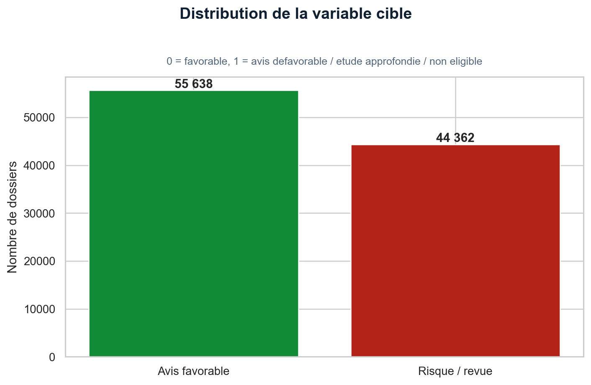
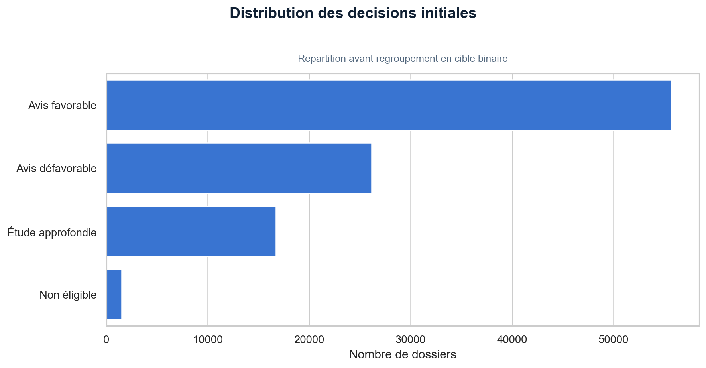
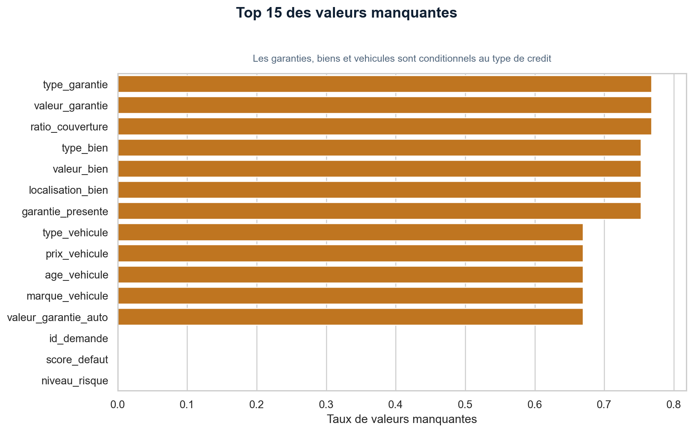
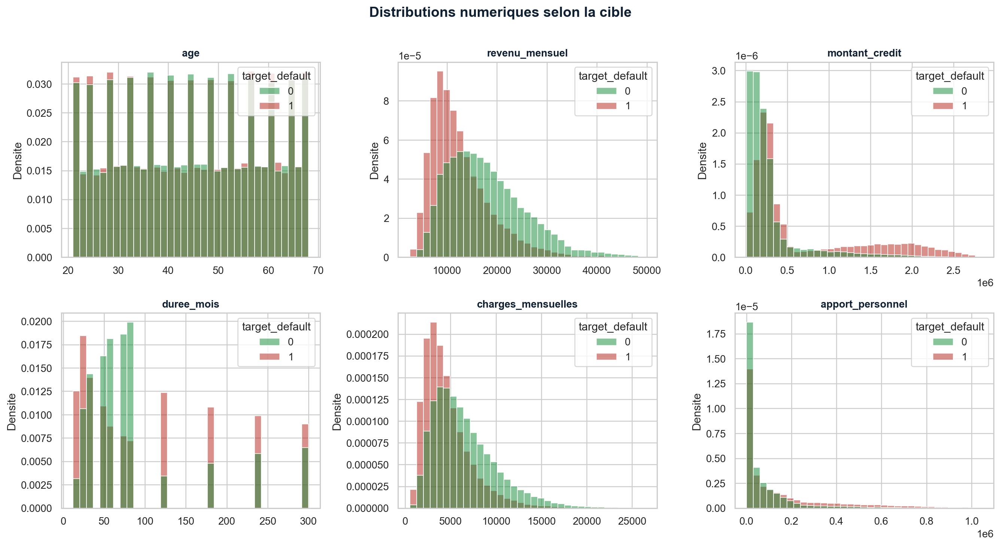
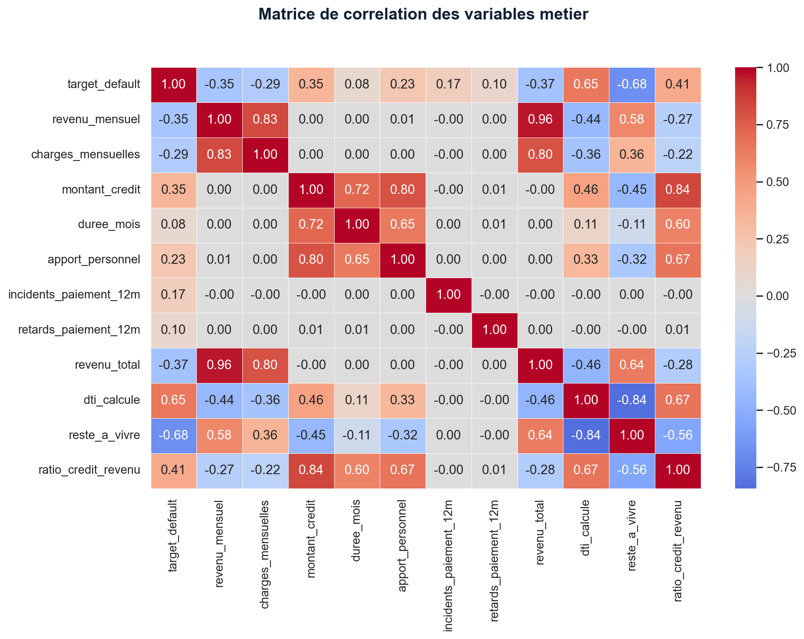
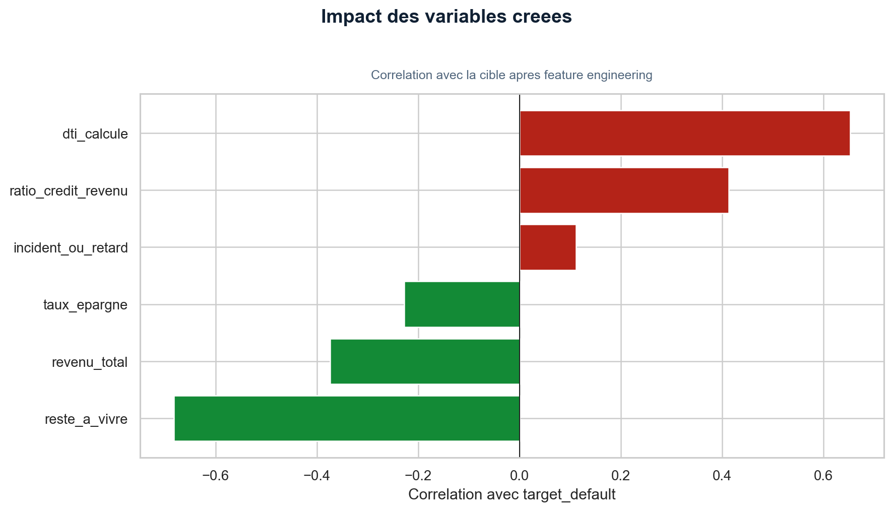
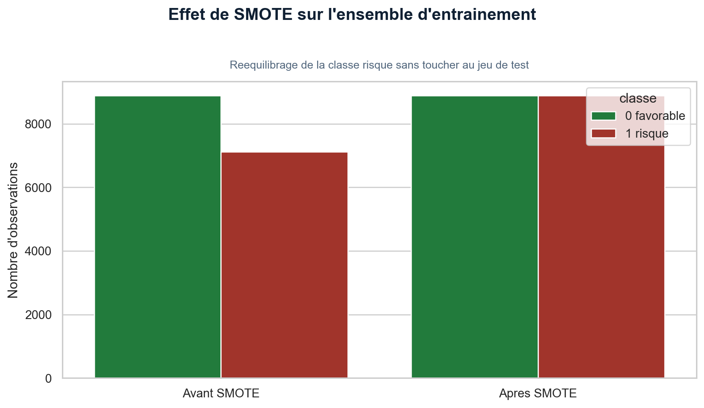

# Rapport de Projet de Fin d'Études

## Système intelligent de prédiction du risque de crédit BMCE

**Présenté par :** [Nom et prénom de l'étudiant]  
**Filière :** [Filière / spécialité]  
**Établissement :** [Nom de l'établissement]  
**Encadrant académique :** [Nom de l'encadrant]  
**Encadrant professionnel :** [À compléter si applicable]  
**Année universitaire :** [2025-2026]  
**Date de soutenance :** [À compléter]  

---

# Dédicace

Je dédie ce travail à ma famille, pour son soutien constant, sa patience et ses encouragements tout au long de mon parcours académique.

Je le dédie également à toutes les personnes qui m'ont accompagné, conseillé et motivé durant la réalisation de ce projet.

---

# Remerciements

Je tiens à exprimer ma profonde gratitude à toutes les personnes ayant contribué, directement ou indirectement, à la réalisation de ce projet de fin d'études.

Mes remerciements s'adressent en premier lieu à mon encadrant académique, [Nom de l'encadrant], pour ses orientations, ses remarques constructives et son accompagnement tout au long du travail.

Je remercie également l'ensemble des enseignants de [Nom de l'établissement] pour les connaissances transmises au cours de ma formation, ainsi que toutes les personnes qui m'ont apporté un soutien technique, moral ou méthodologique pendant la conduite de ce projet.

Enfin, je remercie ma famille et mes proches pour leur confiance, leur patience et leurs encouragements continus.

---

# Résumé

L'évaluation du risque de crédit constitue un enjeu central pour les établissements financiers, car elle influence directement la qualité du portefeuille, la maîtrise du risque et la rapidité de traitement des demandes. Dans ce contexte, ce projet propose la conception d'un système intelligent de prédiction du risque de crédit à partir de données structurées décrivant les caractéristiques personnelles, financières et contractuelles des demandeurs.

Le travail réalisé couvre l'ensemble de la chaîne analytique : exploration des données, nettoyage, construction de la variable cible, ingénierie de variables métier, préparation des données, traitement du déséquilibre de classes, entraînement de plusieurs modèles de machine learning, évaluation comparative, explicabilité globale, puis mise à disposition du modèle au moyen d'une API REST et d'un tableau de bord interactif.

Cinq modèles ont été comparés sur le même jeu de 18 variables : régression logistique, arbre de décision, Random Forest, XGBoost et LightGBM. Chaque modèle est recalibré par méthode sigmoïde et son seuil est choisi sur une validation séparée. LightGBM obtient les meilleurs résultats globaux sur le test : Accuracy de 0,8505, précision de 0,8077, rappel de 0,8656, F1-score de 0,8356 et ROC-AUC de 0,9222. Ces résultats doivent être interprétés comme une validation méthodologique sur un jeu de données synthétique, et non comme une preuve de performance bancaire en production.

Le système développé ne se limite pas à l'entraînement d'un modèle. Il comprend également un service FastAPI permettant de produire des prédictions, un tableau de bord Streamlit facilitant l'analyse et la simulation de dossiers, ainsi qu'un mécanisme de journalisation des prédictions pour assurer la traçabilité.

**Mots clés :** risque de crédit, scoring, machine learning, XGBoost, Random Forest, régression logistique, explicabilité, SHAP, FastAPI, Streamlit.

---

# Abstract

Credit-risk assessment is a major issue for financial institutions because it directly affects portfolio quality, risk control, and the speed of loan processing. This project proposes the design of an intelligent credit-risk prediction system based on structured data describing applicants' personal, financial, and contractual characteristics.

The work covers the full analytical pipeline: exploratory data analysis, cleaning, target construction, business feature engineering, preprocessing, class-imbalance handling, training of several machine-learning models, comparative evaluation, global explainability, and deployment through a REST API and an interactive dashboard.

Five models were compared on the same governed set of 18 variables: logistic regression, decision tree, Random Forest, XGBoost, and LightGBM. Each model was sigmoid-calibrated and its decision threshold selected on a separate validation period. LightGBM achieved the best overall test results, with 0.8505 accuracy, 0.8077 precision, 0.8656 recall, 0.8356 F1-score, and 0.9222 ROC-AUC. These results remain a methodological validation on synthetic data, not evidence of banking production performance.

The proposed system goes beyond model training. It also includes a FastAPI service for predictions, a Streamlit dashboard for analysis and simulation, and a prediction-logging mechanism to support traceability.

**Keywords:** credit risk, scoring, machine learning, XGBoost, Random Forest, logistic regression, explainability, SHAP, FastAPI, Streamlit.

---

# Liste des abréviations

| Abréviation | Signification |
|---|---|
| API | Application Programming Interface |
| AUC | Area Under the Curve |
| DTI | Debt-To-Income ratio |
| EDA | Exploratory Data Analysis |
| F1-score | Moyenne harmonique entre précision et rappel |
| Gini | Indice dérivé de la ROC-AUC |
| ML | Machine Learning |
| PD | Probability of Default |
| ROC | Receiver Operating Characteristic |
| SHAP | SHapley Additive exPlanations |
| SMOTE | Synthetic Minority Over-sampling Technique |

---

# Liste des figures

| Figure | Intitulé |
|---|---|
| Figure 1 | Processus global du pipeline EDA et machine learning |
| Figure 2 | Distribution de la variable cible |
| Figure 3 | Répartition des décisions initiales |
| Figure 4 | Analyse des valeurs manquantes |
| Figure 5 | Distributions numériques principales |
| Figure 6 | Matrice de corrélation |
| Figure 7 | Schéma du feature engineering |
| Figure 8 | Répartition des classes avant et après SMOTE |
| Figure 9 | Comparaison des modèles |
| Figure 10 | Courbe ROC du meilleur modèle |
| Figure 11 | Matrice de confusion |
| Figure 12 | Importance globale des variables |
| Figure 13 | Résumé SHAP |
| Figure 14 | Architecture générale du système |
| Figure 15 | Interface du tableau de bord |

---

# Liste des tableaux

| Tableau | Intitulé |
|---|---|
| Tableau 1 | Objectifs fonctionnels et techniques du projet |
| Tableau 2 | Description générale du jeu de données |
| Tableau 3 | Répartition des décisions bancaires |
| Tableau 4 | Principales variables manquantes |
| Tableau 5 | Variables construites par feature engineering |
| Tableau 6 | Comparaison des modèles entraînés |
| Tableau 7 | Analyse des seuils de décision |
| Tableau 8 | Principales limites et perspectives |

---

# Table des matières

1. Introduction générale  
2. Chapitre 1 — Contexte général, problématique et organisation du projet  
3. Chapitre 2 — État de l'art et choix méthodologiques  
4. Chapitre 3 — Conception, implémentation et résultats  
5. Conclusion générale et perspectives  
6. Bibliographie indicative  
7. Annexes  

---

# Introduction générale

Le crédit joue un rôle essentiel dans le financement des particuliers et des entreprises. Pour les établissements bancaires, l'octroi d'un crédit suppose toutefois une évaluation rigoureuse de la capacité de remboursement du demandeur et du risque associé au dossier. Une mauvaise appréciation du risque peut conduire à une augmentation des défauts de paiement, à une dégradation de la qualité du portefeuille et à des pertes financières importantes.

Traditionnellement, l'analyse d'un dossier de crédit repose sur l'étude de plusieurs dimensions : revenus, charges, endettement, historique de paiement, stabilité professionnelle, garanties et caractéristiques du financement demandé. Avec l'augmentation du volume de données disponibles et l'évolution des techniques d'intelligence artificielle, il devient possible de compléter les approches classiques par des modèles prédictifs capables d'identifier automatiquement des profils à risque.

Le présent projet s'inscrit dans cette logique. Il vise à concevoir un système intelligent de prédiction du risque de crédit fondé sur des techniques de machine learning appliquées à des données structurées de demandes de financement. Le travail ne se limite pas à la comparaison de modèles ; il cherche également à proposer une solution complète et démontrable, allant de l'analyse exploratoire jusqu'à la mise en service via une API et un tableau de bord interactif.

La problématique générale peut être formulée ainsi :

> Comment concevoir un système de scoring de crédit capable d'estimer de manière fiable le risque associé à une demande, tout en restant interprétable, reproductible et exploitable dans un cadre applicatif ?

Pour répondre à cette problématique, le projet poursuit plusieurs objectifs :

- préparer et analyser un jeu de données de demandes de crédit ;
- construire une cible de risque exploitable pour l'apprentissage supervisé ;
- créer des variables métier pertinentes ;
- comparer plusieurs modèles de classification ;
- interpréter les résultats et identifier les facteurs influents ;
- exposer le meilleur modèle à travers une API REST ;
- proposer une interface utilisateur permettant de simuler et visualiser des prédictions.

Le rapport est organisé en trois chapitres principaux. Le premier présente le contexte du projet, la problématique, les objectifs et l'organisation du travail. Le deuxième introduit les fondements théoriques du risque de crédit, du scoring et des méthodes de machine learning employées. Le troisième décrit la méthodologie mise en œuvre, les résultats obtenus, la discussion critique des performances et l'architecture applicative développée.

---

# Chapitre 1 — Contexte général, problématique et organisation du projet

## 1.1 Présentation de l'organisme d'accueil

> **À compléter si le projet est rattaché à une entreprise ou à une banque.**  
> Cette section peut reprendre la logique du rapport modèle : historique, activités principales, organisation, implantation, place du service concerné et lien avec le sujet du PFE.  
> Si ton projet est purement académique, cette partie peut être remplacée par une courte présentation du cadre institutionnel du projet.

## 1.2 Contexte général

Les banques doivent prendre quotidiennement un grand nombre de décisions d'octroi de crédit. Ces décisions doivent concilier plusieurs exigences parfois contradictoires : rapidité de traitement, qualité de service, conformité aux règles internes et maîtrise du risque. Dans un environnement où les données clients sont de plus en plus nombreuses, l'automatisation partielle de l'évaluation du risque devient un levier important d'efficacité et d'aide à la décision.

Le scoring de crédit consiste à attribuer à chaque demande un niveau de risque ou une probabilité de défaut à partir d'informations observables au moment de l'étude du dossier. Les approches modernes combinent souvent des indicateurs financiers classiques, comme le revenu ou le taux d'endettement, avec des techniques d'apprentissage automatique capables de détecter des interactions plus complexes entre variables.

Dans le cadre de ce projet, l'objectif n'est pas de remplacer entièrement l'expertise humaine, mais de construire un outil d'aide à la décision capable de fournir :

- une estimation quantitative du risque ;
- une décision binaire de premier niveau ;
- une segmentation de risque plus lisible pour l'utilisateur ;
- des explications globales sur les facteurs influents ;
- un support applicatif facilement démontrable.

## 1.3 Problématique

L'étude manuelle d'un dossier de crédit peut devenir lente lorsque le nombre de demandes augmente. Par ailleurs, certains profils de risque émergent de la combinaison de plusieurs variables et ne sont pas toujours faciles à repérer avec des règles simples.

La problématique du projet peut donc être décomposée en trois questions :

1. Comment transformer des données bancaires brutes en variables pertinentes pour l'analyse du risque ?
2. Quels modèles permettent d'obtenir un bon compromis entre performance prédictive, robustesse et interprétabilité ?
3. Comment intégrer le modèle retenu dans une solution exploitable au-delà du simple notebook d'expérimentation ?

## 1.4 Objectifs du projet

### 1.4.1 Objectif général

Concevoir et implémenter un système intelligent de prédiction du risque de crédit permettant d'estimer la probabilité de défaut d'un demandeur et de produire une aide à la décision exploitable.

### 1.4.2 Objectifs spécifiques

| Domaine | Objectifs |
|---|---|
| Données | Charger, nettoyer et explorer le jeu de données de crédit |
| Modélisation | Construire une variable cible cohérente et entraîner plusieurs modèles |
| Feature engineering | Créer des indicateurs métier utiles comme le DTI, le reste à vivre ou le taux d'épargne |
| Évaluation | Comparer les modèles avec des métriques adaptées au risque de crédit |
| Explicabilité | Identifier les variables contribuant le plus aux prédictions |
| Déploiement | Exposer le modèle via FastAPI et proposer un tableau de bord Streamlit |
| Reproductibilité | Structurer le projet, sauvegarder les modèles et documenter le pipeline |

## 1.5 Organisation et planification du travail

Le projet a été pensé comme un PFE compact, réalisable dans un calendrier court tout en couvrant les principales étapes d'un cycle de machine learning appliqué.

| Période | Travaux réalisés |
|---|---|
| Semaine 1 | Analyse exploratoire, nettoyage, construction de la cible, premières visualisations |
| Semaine 2 | Feature engineering, entraînement des modèles, validation, comparaison et explicabilité |
| Semaine 3 | Développement de l'API, du tableau de bord, dockerisation et documentation |

Cette organisation a permis d'avancer de manière progressive : d'abord comprendre les données, ensuite construire les modèles, enfin rendre la solution utilisable.

## 1.6 Périmètre du projet

Le périmètre retenu inclut :

- un jeu de données tabulaire relatif à des demandes de crédit ;
- une cible binaire correspondant à un dossier favorable ou à risque ;
- trois familles de modèles supervisés ;
- une évaluation hors échantillon ;
- un prototype applicatif complet.

En revanche, certains éléments restent hors périmètre :

- la mise en production bancaire réelle ;
- l'intégration à un système d'information bancaire existant ;
- la validation réglementaire du modèle ;
- l'estimation complète des pertes attendues de type IFRS 9 ;
- la surveillance avancée du drift en production.

## 1.7 Conclusion du chapitre

Ce premier chapitre a situé le projet dans le contexte de l'aide à la décision bancaire et a clarifié les objectifs poursuivis. Le besoin principal est de transformer des données de demandes de crédit en un système de scoring fiable, explicable et exploitable. Le chapitre suivant présente les concepts et méthodes mobilisés pour atteindre cet objectif.

---

# Chapitre 2 — État de l'art et choix méthodologiques

## 2.1 Risque de crédit et scoring

Le risque de crédit correspond à la possibilité qu'un emprunteur ne respecte pas ses engagements de remboursement. Pour l'institution financière, l'évaluation de ce risque intervient avant l'octroi mais également tout au long de la vie du portefeuille.

Le scoring de crédit vise à produire une mesure synthétique du risque à partir d'un ensemble de variables observables. Historiquement, les modèles statistiques tels que la régression logistique ont été très utilisés en raison de leur simplicité d'interprétation. Avec l'essor du machine learning, des méthodes plus flexibles, notamment les modèles d'ensemble à base d'arbres, sont de plus en plus mobilisées pour capturer des relations non linéaires.

## 2.2 Construction de la variable cible

Dans le projet, la variable d'origine `decision` comporte plusieurs modalités. Afin de formuler le problème comme une classification binaire, la cible `target_default` est construite selon la logique suivante :

| Décision d'origine | Classe cible | Interprétation |
|---|---:|---|
| Avis favorable | 0 | Dossier accepté / moins risqué |
| Avis défavorable | 1 | Dossier à risque |
| Étude approfondie | 1 | Dossier nécessitant vigilance |
| Non éligible | 1 | Dossier non acceptable |

Cette transformation correspond à une **binarisation de la décision**, et non à une simple copie de la décision bancaire initiale. Elle permet de regrouper dans la classe positive tous les dossiers devant attirer l'attention du dispositif de risque.

## 2.3 Méthodes de classification retenues

### 2.3.1 Régression logistique

La régression logistique constitue une méthode de référence en scoring de crédit. Elle fournit une probabilité facilement interprétable, possède peu d'hyperparamètres et permet de comprendre rapidement le sens global de certaines relations.

Dans ce projet, elle est utilisée comme **baseline** avec un sous-ensemble volontairement limité de variables classiques, afin de disposer d'un point de comparaison crédible avec les modèles plus avancés.

### 2.3.2 Random Forest

Random Forest repose sur l'agrégation de plusieurs arbres de décision entraînés sur des échantillons et des sous-ensembles de variables. Cette approche réduit la variance d'un arbre isolé et permet de modéliser des relations complexes sans hypothèse linéaire forte.

### 2.3.3 XGBoost

XGBoost est une méthode de gradient boosting particulièrement performante sur les données tabulaires. Elle construit séquentiellement des arbres dont chacun cherche à corriger les erreurs des précédents. La qualité du modèle dépend fortement de la régularisation et du réglage de paramètres comme la profondeur, le learning rate, le sous-échantillonnage ou la pénalisation.

## 2.4 Prétraitement des données

Les données brutes nécessitent plusieurs opérations avant d'être injectées dans les modèles :

- suppression des doublons ;
- conversion des dates ;
- traitement des chaînes vides ;
- imputation des valeurs manquantes ;
- standardisation des variables numériques ;
- encodage des variables catégorielles.

Le projet s'appuie sur un `ColumnTransformer` afin de séparer proprement le traitement des variables numériques et catégorielles.

## 2.5 Déséquilibre des classes et SMOTE

Lorsque les classes sont déséquilibrées, un modèle peut privilégier la classe majoritaire et négliger les dossiers risqués. Pour limiter ce phénomène, la méthode SMOTE est appliquée uniquement sur l'ensemble d'entraînement. Elle produit de nouveaux exemples synthétiques de la classe minoritaire à partir d'observations existantes.

Le fait de n'appliquer SMOTE qu'au jeu d'entraînement est essentiel : l'utiliser avant la séparation train/test conduirait à une fuite d'information et à une estimation trop optimiste des performances.

## 2.6 Métriques d'évaluation

L'accuracy seule est insuffisante pour évaluer un système de scoring. Le projet emploie plusieurs indicateurs complémentaires :

- **Précision** : proportion de dossiers prédits risqués qui le sont réellement ;
- **Rappel** : proportion de dossiers réellement risqués correctement détectés ;
- **F1-score** : compromis entre précision et rappel ;
- **ROC-AUC** : capacité globale de discrimination du modèle ;
- **Gini** : transformation de l'AUC souvent utilisée en contexte de scoring ;
- **KS** : séparation maximale entre distributions de scores des classes.

Cette pluralité de métriques permet de mieux comprendre le comportement des modèles et d'éviter une lecture trop simpliste des résultats.

## 2.7 Explicabilité

Dans un domaine sensible comme le crédit, la performance brute ne suffit pas. Il est également important de comprendre quels facteurs contribuent aux prédictions. Le projet utilise deux approches complémentaires :

- l'importance globale des variables issue du modèle retenu ;
- une analyse SHAP synthétique afin d'évaluer l'effet des principales variables sur les prédictions.

Ces outils restent des instruments d'interprétation et non des preuves de causalité.

## 2.8 Choix technologiques

| Besoin | Technologie retenue |
|---|---|
| Manipulation des données | pandas, NumPy |
| Modélisation | scikit-learn, imbalanced-learn, XGBoost |
| Visualisation | matplotlib, seaborn |
| Explicabilité | SHAP |
| API | FastAPI |
| Interface utilisateur | Streamlit |
| Packaging et déploiement | Docker, Docker Compose |

## 2.9 Conclusion du chapitre

Ce chapitre a présenté les principaux concepts mobilisés par le projet : risque de crédit, scoring, modèles supervisés, traitement du déséquilibre, choix des métriques et explicabilité. Ces éléments constituent le socle méthodologique sur lequel repose l'implémentation décrite dans le chapitre suivant.

---

# Chapitre 3 — Conception, implémentation et résultats

## 3.1 Vue d'ensemble de l'architecture

Le système développé suit une architecture modulaire allant des données brutes jusqu'à l'exploitation applicative :

1. chargement du fichier source ;
2. analyse exploratoire ;
3. nettoyage et transformation des données ;
4. création de variables métier ;
5. entraînement et sélection du meilleur modèle ;
6. génération de métriques et figures ;
7. exposition du modèle via API ;
8. restitution via tableau de bord.


La séparation des responsabilités entre les fichiers `data_processing.py`, `modeling.py`, `evaluation.py`, `xai.py`, `api/main.py` et `dashboard/app.py` améliore la lisibilité et la maintenabilité de la solution.

## 3.2 Description du jeu de données

Le fichier exploité est `dataset_credit_bmce_100k.csv`.

Ce jeu de données est synthétique. Il est adapté à un prototype académique et à la démonstration d'une méthodologie complète, mais il ne remplace pas une validation sur des données bancaires réelles, anonymisées et contrôlées par des experts métier.

| Indicateur | Valeur |
|---|---:|
| Nombre de lignes | 100 000 |
| Nombre de colonnes brutes | 47 |
| Nombre de colonnes après création de la cible | 48 |
| Taux de dossiers à risque | 44,36 % |
| Taux de valeurs manquantes dans le CSV brut | 18,43 % |
| Taux après création de la cible | 18,04 % |
| Doublons détectés | 0 |

La variable `decision` présente initialement quatre modalités principales :

| Décision | Nombre de dossiers |
|---|---:|
| Avis favorable | 55 638 |
| Avis défavorable | 26 127 |
| Étude approfondie | 16 719 |
| Non éligible | 1 516 |

### 3.2.1 Traçabilité et statut de la dataset card

Une dataset card a été ajoutée au projet afin de rendre explicites la provenance connue, le dictionnaire des variables, la construction de la cible, les usages prévus, les biais et les limites. L'instantané analysé pèse 25 557 339 octets et possède l'empreinte SHA-256 `45C23401EA6A9818145D6D388ACC2C782000D01AA18377EA098751A498F17119`.

La période du 1er janvier 2023 au 26 mars 2026 correspond à des dates simulées. Le dépôt ne contient ni le générateur d'origine, ni sa graine aléatoire, ni une licence de redistribution. Le nom du fichier ne permet donc pas d'attribuer ces données à BMCE Bank of Africa : elles sont traitées exclusivement comme un support académique synthétique. La dataset card complète est reproduite en annexe F et maintenue séparément dans `DATASET_CARD.md`.





## 3.3 Qualité des données et valeurs manquantes

Certaines colonnes comportent de nombreux manquants, notamment les variables relatives aux garanties, aux véhicules ou aux biens immobiliers. Cette absence n'est pas nécessairement une erreur : elle peut refléter la nature du produit demandé. Par exemple, les variables liées à un véhicule ne sont logiquement renseignées que pour les crédits automobiles.

| Variable | Taux de valeurs manquantes |
|---|---:|
| `ratio_couverture` | 76,79 % |
| `valeur_garantie` | 76,79 % |
| `type_garantie` | 76,79 % |
| `garantie_presente` | 75,27 % |
| `valeur_bien` | 75,27 % |
| `type_bien` | 75,27 % |
| `localisation_bien` | 75,27 % |
| `prix_vehicule` | 66,94 % |
| `age_vehicule` | 66,94 % |
| `marque_vehicule` | 66,94 % |



Le pipeline traite ces manquants par :

- imputation médiane pour les variables numériques ;
- imputation par la modalité la plus fréquente pour les variables catégorielles.

## 3.4 Analyse exploratoire

L'analyse exploratoire permet d'étudier la distribution des variables et leur relation avec la cible. Les distributions de l'âge, du revenu mensuel, du montant du crédit, de la durée et du taux d'endettement ont été générées afin d'identifier des tendances générales.



La matrice de corrélation met en évidence plusieurs variables étroitement associées au risque. Après traitement des variables de fuite évidentes, les variables métier les plus corrélées avec la cible sont notamment :

| Variable | Corrélation absolue avec la cible |
|---|---:|
| `reste_a_vivre` | 0,682 |
| `dti_calcule` | 0,653 |
| `ratio_credit_revenu` | 0,413 |
| `revenu_total` | 0,374 |
| `revenu_mensuel` | 0,351 |



## 3.5 Feature engineering

Le feature engineering constitue une étape importante, car les variables construites traduisent plus directement des logiques métier que certaines colonnes brutes.

| Variable construite | Définition |
|---|---|
| `revenu_total` | `revenu_mensuel + revenu_supplementaire` |
| `dti_calcule` | `(mensualites_existantes + mensualite_estimee) / revenu_total` |
| `reste_a_vivre` | `revenu_total - charges_mensuelles - mensualites_totales` |
| `taux_epargne` | `epargne_mensuelle / revenu_total` |
| `ratio_credit_revenu` | `montant_credit / revenu_total` |
| `incident_ou_retard` | 1 si incident ou retard de paiement existe |
| `annee_demande` | année extraite de la date |
| `mois_demande` | mois extrait de la date |
| `age_bin` | tranche d'âge |
| `revenu_bin` | tranche de revenu |
| `montant_credit_bin` | tranche de montant demandé |



Ces variables permettent, par exemple, de distinguer deux clients ayant le même revenu mais des charges, des mensualités ou une épargne très différentes.

## 3.6 Contrôle des variables de fuite

Afin d'éviter que le modèle n'apprenne indirectement la réponse déjà connue, plusieurs variables sont exclues de l'entraînement :

- `id_demande` ;
- `decision` ;
- `score_defaut` ;
- `niveau_risque`.

De plus, plusieurs colonnes proches de règles bancaires explicites sont retirées du modèle final :

- `taux_endettement` ;
- `mensualite_estimee` ;
- `ratio_apport` ;
- `ratio_couverture` ;
- `valeur_garantie` ;
- `valeur_garantie_auto` ;
- `valeur_bien`.

Cette décision méthodologique vise à rendre l'évaluation plus défendable et moins artificiellement favorable.

## 3.7 Déséquilibre des classes

Avant rééquilibrage, l'échantillon d'entraînement contient :

| Classe | Effectif |
|---|---:|
| 0 | 8 884 |
| 1 | 7 116 |

Après application de SMOTE uniquement sur l'ensemble d'entraînement :

| Classe | Effectif |
|---|---:|
| 0 | 8 884 |
| 1 | 8 884 |



## 3.8 Protocole d'entraînement

Le processus d'entraînement suit les étapes suivantes :

1. chargement du fichier source ;
2. sous-échantillonnage stratifié à 20 000 lignes pour garder un temps de calcul compatible avec un PFE local ;
3. préparation des variables ;
4. séparation temporelle si possible, sinon séparation stratifiée ;
5. construction du préprocesseur ;
6. entraînement de trois modèles via `GridSearchCV` ;
7. sélection du meilleur modèle selon la ROC-AUC ;
8. sauvegarde du modèle, des métriques et des métadonnées.

Les modèles comparés sont :

- régression logistique ;
- Random Forest ;
- XGBoost.

## 3.9 Résultats comparatifs

Les résultats ci-dessous sont calculés après calibration sigmoïde de chaque modèle. Le seuil de chaque classifieur maximise le F1 sur une période de validation distincte ; les 4 000 dossiers de test restent réservés à l'évaluation finale.

| Modèle | Accuracy | Précision | Rappel | F1 | ROC-AUC | Gini | KS |
|---|---:|---:|---:|---:|---:|---:|---:|
| Régression logistique | 0,8288 | 0,7906 | 0,8297 | 0,8097 | 0,9009 | 0,8018 | 0,6614 |
| Arbre de décision | 0,8205 | 0,7808 | 0,8218 | 0,8008 | 0,9049 | 0,8098 | 0,6441 |
| Random Forest | 0,8305 | 0,7781 | 0,8588 | 0,8165 | 0,9095 | 0,8189 | 0,6721 |
| XGBoost | 0,8135 | 0,7587 | 0,8434 | 0,7988 | 0,8940 | 0,7879 | 0,6350 |
| LightGBM | 0,8505 | 0,8077 | 0,8656 | 0,8356 | 0,9222 | 0,8443 | 0,7071 |


LightGBM obtient la meilleure ROC-AUC, le meilleur F1-score et le plus faible Brier score. Random Forest présente la plus faible ECE. XGBoost atteint une ROC-AUC réelle de 0,8940 après recalibration, mais n'est pas le meilleur modèle de ce protocole.

## 3.10 Évaluation détaillée du modèle XGBoost recalibré

### 3.10.1 Courbe ROC


La courbe est calculée directement à partir des probabilités recalibrées pour les 4 000 observations du jeu de test. La ROC-AUC est de 0,8940 et le Gini correspondant de 0,7879. Aucun point de la courbe n'est reconstruit depuis une métrique agrégée et la valeur n'est pas plafonnée.

### 3.10.2 Courbe KS


Le maximum de l'écart entre les distributions cumulées atteint KS = 0,6350 au seuil de score 0,3909. Les points sont calculés sur les seuils distincts des prédictions, ce qui traite correctement les scores ex æquo.

### 3.10.3 Courbe de calibration


La calibration est mesurée sur dix groupes quantiles. Après recalibration sigmoïde sur validation séparée, le Brier score vaut 0,1304 et l'erreur de calibration attendue (ECE) 0,0334.

### 3.10.4 Matrice de confusion


La matrice est calculée directement sur les 4 000 observations du jeu de test au seuil validé de 0,4014 : 1 773 vrais négatifs, 471 faux positifs, 275 faux négatifs et 1 481 vrais positifs. Dans le contexte du crédit, les faux négatifs sont particulièrement sensibles puisqu'ils correspondent à des dossiers risqués classés à tort comme favorables. Cette lecture reste méthodologique et ne remplace pas une validation sur données bancaires réelles.

### 3.10.5 Analyse des seuils


| Seuil | Effet principal | Interprétation |
|---:|---|---|
| 0,30 | Rappel plus élevé | Davantage de dossiers risqués sont détectés, au prix de plus de faux positifs |
| 0,4014 | Seuil validé | Accuracy 0,8135 ; précision 0,7587 ; rappel 0,8434 ; F1 0,7988 |
| 0,70 | Précision plus élevée | Les alertes sont plus sélectives, mais davantage de dossiers risqués peuvent être manqués |

L'analyse des seuils montre le compromis classique entre rappel et précision. Le seuil 0,4014 a été sélectionné sur une validation distincte, sans optimiser sur le test. Le choix opérationnel doit néanmoins être fondé sur les coûts métier et validé sur des données bancaires réelles.

## 3.11 Discussion critique des performances

Les performances obtenues sont satisfaisantes pour un prototype académique. Elles ne doivent cependant pas être interprétées comme une validation bancaire réelle. Une analyse univariée montre que certaines variables sont déjà très discriminantes isolément :

| Variable | ROC-AUC seule approximative |
|---|---:|
| `dti_calcule` | 0,954 |
| `reste_a_vivre` | 0,934 |
| `ratio_credit_revenu` | 0,798 |

Cette observation suggère que le jeu de données synthétique est fortement structuré autour de règles métier de solvabilité. Ainsi, les modèles avancés apprennent un signal très présent dans les données. Les résultats sont donc utiles pour valider la cohérence de la démarche, mais ils ne constituent pas une preuve de performance en conditions réelles.

Pour cette raison, le projet adopte plusieurs mesures de rigueur :

- suppression des variables de fuite évidentes ;
- retrait des variables trop proches des règles de décision ;
- séparation train/test avant toute génération synthétique ;
- comparaison avec une baseline volontairement plus simple ;
- analyse multi-métriques plutôt qu'une lecture fondée uniquement sur l'accuracy.

Une amélioration pertinente pour une version ultérieure serait d'ajouter une **étude d'ablation** montrant la variation des performances avec et sans `dti_calcule`, `reste_a_vivre` et d'autres variables dominantes.

## 3.12 Explicabilité

### 3.12.1 Importance des variables


L'importance globale des variables permet d'identifier les indicateurs ayant le plus contribué à la décision du modèle.

### 3.12.2 Analyse SHAP


SHAP complète cette analyse en montrant comment les variables influencent globalement les prédictions. Cette approche améliore la compréhension du modèle tout en rappelant qu'une contribution statistique n'équivaut pas nécessairement à un lien causal.

## 3.13 Mise en service du modèle

### 3.13.1 API FastAPI

L'API fournit notamment :

- un endpoint `/health` pour vérifier le chargement du modèle ;
- un endpoint `/predict` pour recevoir un ou plusieurs dossiers ;
- une sortie comprenant la probabilité de défaut, un score de crédit, un segment de risque et une décision.

Exemple de réponse :

```json
{
  "pd_default": 0.2715,
  "score_credit": 701,
  "segment_risque": "Moyen",
  "decision": "Avis favorable"
}
```

La sortie distingue volontairement deux niveaux :

- la **décision** (`Avis favorable` ou `Avis défavorable`), utilisée comme réponse binaire de premier niveau ;
- le **segment de risque** (`Très bon`, `Bon`, `Moyen`, `Risqué`, `Très risqué`), qui offre une lecture plus graduée de la probabilité de défaut.

### 3.13.2 Tableau de bord Streamlit

Le tableau de bord permet :

- de visualiser les indicateurs globaux ;
- de simuler un nouveau dossier ;
- de calculer un score de crédit ;
- d'afficher la décision et le segment de risque ;
- de comparer un client à des profils similaires ;
- de scorer un lot de demandes ;
- de consulter les journaux de prédictions.


## 3.14 Limites du travail

| Limite | Explication |
|---|---|
| Données synthétiques | Elles ne remplacent pas une validation sur données bancaires réelles |
| Jeu très structuré | Certaines variables captent déjà fortement la décision |
| Échantillon d'entraînement réduit | 20 000 lignes seulement sont utilisées pour préserver le temps de calcul local |
| Absence de drift monitoring avancé | La surveillance continue du modèle reste à développer |
| Absence de validation métier réelle | Le prototype reste un outil académique de démonstration |

## 3.15 Conclusion du chapitre

Ce chapitre a présenté la solution complète mise en œuvre, depuis les données brutes jusqu'au prototype opérationnel. Les résultats montrent qu'un pipeline de machine learning correctement structuré peut produire une estimation cohérente du risque de crédit sur un dataset synthétique, tout en restant explicable et intégrable à une application métier. Les performances doivent être interprétées à la lumière de la nature synthétique du jeu de données et des variables fortement discriminantes qu'il contient.

---

# Conclusion générale et perspectives

Ce projet avait pour objectif de concevoir un système intelligent de prédiction du risque de crédit à partir de données structurées de demandes bancaires. Les différentes étapes ont été menées de manière progressive : compréhension du jeu de données, préparation, construction de variables métier, modélisation, évaluation, explicabilité et intégration applicative.

Les résultats recalculés montrent que LightGBM obtient la meilleure performance globale sur ce jeu synthétique, avec une ROC-AUC de 0,9222 et un F1-score de 0,8356 au seuil validé de 0,4062. Random Forest offre la plus faible ECE, tandis que XGBoost atteint une ROC-AUC de 0,8940. Cette comparaison constitue une validation méthodologique et non une preuve de performance bancaire en production.

Au-delà de la performance, le projet a mis l'accent sur la rigueur méthodologique : retrait des variables de fuite, traitement adapté des valeurs manquantes, application correcte de SMOTE, comparaison multi-métriques, conservation d'une baseline interprétable et ajout d'outils d'explicabilité. L'intégration via FastAPI et Streamlit transforme le travail en prototype utilisable, tout en gardant clairement la limite suivante : aucune conclusion de production ne peut être tirée sans validation sur données bancaires réelles.

Plusieurs perspectives peuvent être envisagées :

1. conduire une étude d'ablation systématique des variables dominantes ;
2. tester une validation croisée temporelle plus poussée ;
3. intégrer une calibration des probabilités ;
4. ajouter un suivi du drift et du PSI ;
5. développer une explicabilité locale dossier par dossier ;
6. valider le système sur des données réelles anonymisées ;
7. enrichir le tableau de bord avec des scénarios de simulation et des recommandations métier.

En définitive, ce travail montre qu'un PFE peut aller au-delà d'une simple comparaison d'algorithmes en proposant une chaîne complète, cohérente et défendable de scoring de crédit.

---

# Bibliographie indicative

> Cette section doit être adaptée selon les consignes de l'établissement et complétée avec les références effectivement utilisées dans le mémoire.

1. Ouvrages et articles sur le risque de crédit et le scoring bancaire.  
2. Documentation officielle de scikit-learn pour les pipelines, la validation et les métriques.  
3. Documentation officielle de XGBoost.  
4. Documentation de FastAPI et Streamlit.  
5. Article fondateur sur SHAP et travaux relatifs à l'explicabilité des modèles.  
6. Références sur SMOTE et le traitement du déséquilibre de classes.  

---

# Annexes

## Annexe A — Structure technique du projet

```text
.
+-- dataset_credit_bmce_100k.csv
+-- DATASET_CARD.md
+-- eda.py
+-- train.py
+-- src/
|   +-- config.py
|   +-- data_processing.py
|   +-- modeling.py
|   +-- evaluation.py
|   +-- xai.py
+-- api/
|   +-- main.py
+-- dashboard/
|   +-- app.py
+-- models/
|   +-- best_model.joblib
|   +-- metadata.json
+-- reports/
|   +-- final_metrics.json
|   +-- model_comparison.csv
|   +-- threshold_analysis.csv
|   +-- figures/
+-- logs/
|   +-- predictions.csv
+-- Dockerfile
+-- docker-compose.yml
```

## Annexe B — Principaux fichiers produits

| Fichier | Rôle |
|---|---|
| `DATASET_CARD.md` | documentation, provenance, schéma et limites du jeu synthétique |
| `reports/final_metrics.json` | métriques finales du meilleur modèle |
| `reports/model_comparison.csv` | comparaison des modèles |
| `reports/threshold_analysis.csv` | analyse des seuils |
| `models/best_model.joblib` | modèle sauvegardé |
| `models/metadata.json` | métadonnées du modèle |
| `logs/predictions.csv` | journalisation des prédictions |

## Annexe C — Segmentation de risque utilisée

| Probabilité de défaut | Segment |
|---|---|
| `< 0,10` | Très bon |
| `[0,10 ; 0,25[` | Bon |
| `[0,25 ; 0,45[` | Moyen |
| `[0,45 ; 0,65[` | Risqué |
| `>= 0,65` | Très risqué |

## Annexe D — Exemple de logique métier des variables construites

- `dti_calcule` mesure la part du revenu consacrée au remboursement des crédits ;
- `reste_a_vivre` estime le montant disponible après charges et mensualités ;
- `taux_epargne` reflète la capacité à dégager une épargne régulière ;
- `ratio_credit_revenu` compare le montant demandé au revenu total ;
- `incident_ou_retard` résume l'existence d'événements de paiement défavorables.

## Annexe E — Éléments à personnaliser avant remise

1. Nom de l'étudiant, encadrants, établissement et année universitaire.  
2. Présentation de l'organisme d'accueil si le PFE est rattaché à une entreprise.  
3. Bibliographie réelle au format demandé par l'école.  
4. Numérotation définitive des figures et tableaux dans le format de rendu final.  
5. Ajout éventuel d'un planning graphique, d'un diagramme de Gantt et de captures d'écran propres à la soutenance.  

## Annexe F — Dataset card du jeu de données synthétique

### F.1 Identité et traçabilité

| Champ | Valeur |
|---|---|
| Nom local | Jeu synthétique de demandes de crédit |
| Fichier | `dataset_credit_bmce_100k.csv` |
| Unité d'observation | Une demande de crédit simulée |
| Format | CSV UTF-8, séparateur virgule |
| Dimensions | 100 000 lignes et 47 colonnes brutes |
| Taille | 25 557 339 octets, soit environ 24,37 Mio |
| Période simulée | 2023-01-01 au 2026-03-26 |
| Empreinte | SHA-256 `45C23401EA6A9818145D6D388ACC2C782000D01AA18377EA098751A498F17119` |
| Version | Instantané local non versionné |
| Producteur et contact | Non documentés dans le dépôt |
| Licence | Non spécifiée ; redistribution à clarifier |
| Statistiques vérifiées le | 19 juin 2026 |

Le fichier représente des dossiers fictifs dans un contexte marocain simulé. Il ne contient pas de preuve d'une origine bancaire réelle, d'une affiliation à BMCE Bank of Africa ou d'une validation par cette banque. Aucune ligne ne doit être interprétée comme le dossier d'une personne réelle.

### F.2 Finalité et usages exclus

Les usages prévus sont la démonstration académique d'un pipeline de classification, l'EDA, le feature engineering, la comparaison de modèles, l'explicabilité et le prototypage d'une API ou d'un tableau de bord.

Le jeu ne doit pas servir à accepter, refuser ou tarifer un crédit réel, à calculer un risque réglementaire ou IFRS 9, à évaluer un établissement bancaire, ni à tirer des conclusions sur la population marocaine. Tout passage en production nécessiterait des données réelles légalement utilisables, représentatives, gouvernées et validées par les fonctions risque, conformité et métier.

### F.3 Cible et composition

La cible `target_default` est construite à partir de `decision`. Elle vaut 0 pour « Avis favorable » et 1 pour « Avis défavorable », « Étude approfondie » ou « Non éligible ». Malgré son nom, elle représente une décision synthétique et non un défaut de remboursement observé.

| Décision source | Dossiers | Part | Cible |
|---|---:|---:|---:|
| Avis favorable | 55 638 | 55,64 % | 0 |
| Avis défavorable | 26 127 | 26,13 % | 1 |
| Étude approfondie | 16 719 | 16,72 % | 1 |
| Non éligible | 1 516 | 1,52 % | 1 |

La classe positive contient 44 362 dossiers, soit 44,362 %. Les produits sont répartis entre 42 212 crédits personnels, 33 061 crédits automobiles et 24 727 crédits immobiliers.

### F.4 Dictionnaire des 47 variables brutes

Les montants sont exprimés dans une unité monétaire qui n'est pas documentée dans le dépôt.

| Groupe | Variables | Description synthétique |
|---|---|---|
| Identification | `id_demande` | Identifiant technique unique, de 1 à 100 000 |
| Temps | `date_demande` | Date simulée de dépôt, de 2023-01-01 à 2026-03-26 |
| Démographie | `age`, `sexe`, `situation_familiale`, `nombre_personnes_charge`, `niveau_etude`, `ville` | Profil déclaré ; âge de 21 à 68 ans, sexe binaire et 12 villes |
| Logement | `type_logement` | Locataire, famille, propriétaire ou logement de fonction |
| Emploi | `statut_professionnel`, `type_contrat`, `anciennete_emploi_mois`, `secteur_activite` | Situation, contrat, ancienneté de 3 à 480 mois et secteur |
| Revenus et charges | `revenu_mensuel`, `revenu_supplementaire`, `charges_mensuelles`, `epargne_mensuelle`, `solde_moyen_compte` | Flux et soldes financiers synthétiques |
| Endettement existant | `credits_en_cours`, `mensualites_existantes` | Nombre de crédits, de 0 à 4, et mensualités existantes |
| Historique bancaire | `incidents_paiement_12m`, `retards_paiement_12m`, `anciennete_bancaire_mois` | Incidents, retards et ancienneté de 1 à 300 mois |
| Demande | `type_credit`, `montant_credit`, `duree_mois`, `taux_interet`, `mensualite_estimee`, `objet_credit` | Caractéristiques du financement demandé |
| Apport et ratios | `apport_personnel`, `ratio_apport`, `taux_endettement` | Apport, part d'apport et taux d'endettement synthétique |
| Automobile | `type_vehicule`, `prix_vehicule`, `age_vehicule`, `marque_vehicule`, `valeur_garantie_auto` | Bloc renseigné uniquement pour les 33 061 crédits auto |
| Immobilier | `type_bien`, `valeur_bien`, `localisation_bien`, `garantie_presente` | Bloc renseigné uniquement pour les 24 727 crédits immobiliers |
| Garantie | `type_garantie`, `valeur_garantie`, `ratio_couverture` | Détail renseigné pour les 23 211 dossiers avec garantie |
| Sorties synthétiques | `score_defaut`, `niveau_risque`, `decision` | Score et résultats de la règle de décision ; variables de fuite |

Les domaines catégoriels détaillés, les plages numériques et les taux de manquants par colonne sont conservés dans la version autonome `DATASET_CARD.md` du dépôt.

### F.5 Qualité et valeurs manquantes

| Contrôle | Résultat |
|---|---:|
| Lignes dupliquées | 0 |
| Identifiants dupliqués | 0 |
| Dates invalides ou manquantes | 0 |
| Cellules manquantes dans le CSV | 866 154 sur 4 700 000, soit 18,43 % |
| Colonnes comportant des manquants | 12 sur 47 |

Les manquants observés sont contextuels. Les cinq variables automobiles ont 66,94 % de valeurs manquantes et sont renseignées exactement pour les crédits auto. Les quatre variables immobilières ont 75,27 % de valeurs manquantes et sont renseignées exactement pour les crédits immobiliers. Les trois détails de garantie ont 76,79 % de valeurs manquantes et ne sont présents que lorsque `garantie_presente` vaut « Oui ».

Certaines valeurs extrêmes, dont un `taux_endettement` maximal de 882,42 %, peuvent être artificielles. Les catégories régulières et les relations déterministes du générateur peuvent également rendre la classification plus facile que sur des dossiers réels.

### F.6 Provenance et reproductibilité

Le dépôt ne contient pas le script de génération des lignes, les distributions sources, les dépendances imposées, la règle produisant la décision, la graine aléatoire ou une comparaison avec une population réelle. La génération exacte n'est donc pas reproductible. Les statistiques de cette annexe décrivent le fichier observé et ne reconstituent pas son algorithme de création.

Le CSV ne définit aucun découpage officiel. Le pipeline prélève un échantillon stratifié de 20 000 lignes avec la graine 42, puis réserve les 20 % de dates les plus récentes au test lorsque les dates sont valides. L'imputation, l'encodage, la sélection et SMOTE sont appliqués dans le pipeline d'entraînement.

Les variables `id_demande`, `decision`, `score_defaut` et `niveau_risque` sont exclues comme fuites. Les variables proches des règles de décision — `taux_endettement`, `mensualite_estimee`, `ratio_apport`, `ratio_couverture`, `valeur_garantie`, `valeur_garantie_auto` et `valeur_bien` — sont aussi retirées de l'entraînement final.

### F.7 Biais, équité, confidentialité et maintenance

Le jeu contient des attributs sensibles ou des proxys potentiels : sexe, âge, situation familiale, ville, logement et statut professionnel. La répartition du sexe est presque équilibrée, avec 49 855 lignes « Femme » et 50 145 lignes « Homme ». Les taux de cible positive sont de 44,05 % et 44,68 %, mais cet écart synthétique de 0,63 point ne démontre pas l'équité d'une politique réelle. La représentation binaire du sexe, la plage d'âge 21–68 ans, l'absence de zones rurales et la couverture limitée à 12 villes restreignent fortement la généralisation.

Le fichier ne contient ni nom, ni adresse précise, ni numéro de compte, ni téléphone, ni courriel. Sa nature synthétique réduit le risque de divulgation, sans permettre de le certifier en l'absence du générateur. Il ne doit pas être fusionné avec des dossiers clients ou publié comme donnée bancaire officielle.

Chaque nouvelle version doit être accompagnée du script, de la configuration et de la graine de génération, d'un numéro de version, d'une licence, d'un responsable, d'une nouvelle empreinte SHA-256 et de contrôles de schéma, d'unicité, de plages, de cohérence et d'équité. La card autonome et cette annexe doivent être mises à jour ensemble.
